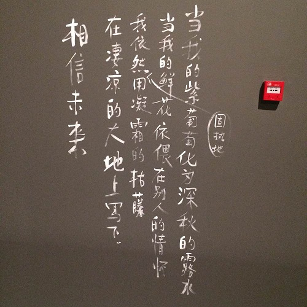

 自从前些天看了路遥的《早晨从中午开始》，就被他写作时的状态所感染，内心突然有了一种很大的要写东西的诉求。上次有这种感觉还是在15年初考完研之后，在家惶惶不安的等着成绩，脑子里却有无数的想法冒出来，大概是备考的半年里，精神高度紧张，一旦放松下来，很多当时意识到却又没有仔细思考的问题就都找上门来了。上周安心看了几天论文，写了大概30多页的总结后，这种要写些什么的冲动就更加强烈了。想写技术总结，想写生活感受，想写脑子里晃来晃去的那些想法。于是我花了一个通宵的时间搭了个博客，想要把这些想法都记录下来，也便有了现在所看到的这个样子。 
 早上迷迷糊糊睡了不到三个小时，又赶忙爬起来赶去实验室，拿起手机的第一眼，竟意想不到的收到了远在德国的小昭昭的问候。我和她在大学中几乎没有交集，却在毕业之后机缘巧合的成为了朋友。几番寒暄之后才知道各自都跟另一半分了手，重新做起了“孤家寡人”，不免感慨起世事无常，物是人非。 不过让我放心的是，她的心态还是积极的很，字里行间能让人感到她的乐观、坚定。  

 她给我说，最近觉得世界很大，很精彩，也发现了自己还有很多不足，需要弥补和提高。谈恋爱的事情，就等觉得自己经历的差不多了再说，毕竟只有做好了自己，才知道自己想要什么样的人。  

 我笑了笑告诉她，就是嘛，不要着急，就当是跟自己好好地谈场恋爱。  

 是啊，我们有多久都是在追逐着外界的种种，却忘了跟自己好好地相处。 2017年已经过半，我还有着很多很多的事情想要去做，好好地写两篇论文，去看买了许久的书，去健身，去逛博物馆，去吃遍北京城的大街小巷，去跟自己好好地谈谈心，有时间的话，能去一趟心心念念的日本。  

 我一直喜欢独处，但之前却一直封闭了自己的内心，将自己与外界隔绝。现在慢慢觉得，要参与到这个世界中来，去梦想，去感受，去和周围的人和事互动。我希望有一天自己能够有一颗平和、宽容的内心，学会爱自己，更要学会爱别人。  

 这些是写在一开始的话，我会将生活中的点点滴滴记录在这里，记录自己的改变，记录自己的成长。师弟调侃我装文艺骗妹子，我就这么轻易地被看穿了，但会不会也是因为，只有先过得了一个精彩的人生，才能守得住一份美好的爱情？  

 最后感谢小昭昭的正能量，祝你在异国身体健康，一切安好！
 